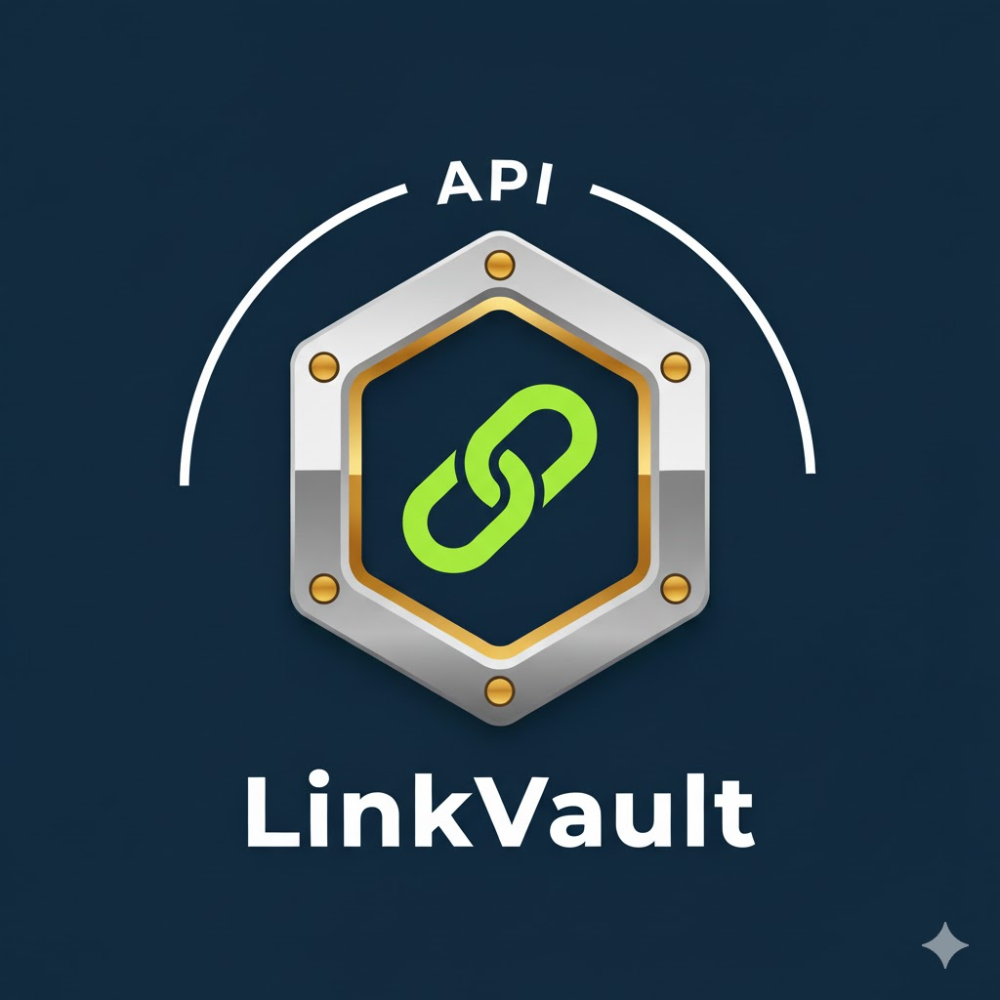
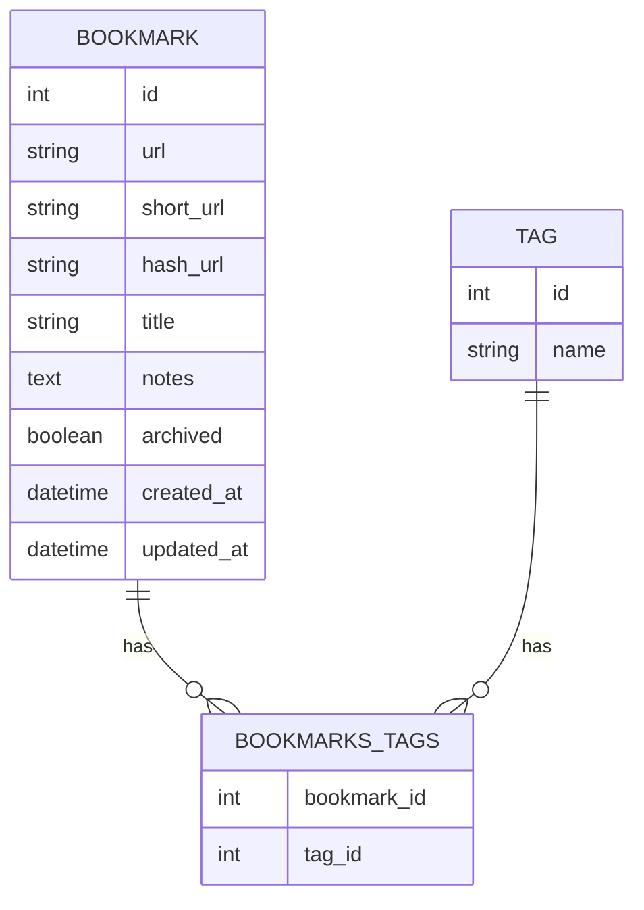

# LinkVault API Project

### **Project 05**  
**Project Title**: LinkVault API – Bookmark & Tag Management System  
**Project Description**:  
Constructed a self-hosted bookmarking API that enables users to save, tag, and retrieve web links programmatically. The system supports duplicate detection, tag-based filtering, and CLI-based import/export in standard formats, functioning as a privacy-focused alternative to commercial bookmarking services.

**Objective**:  
- Design an API to store URLs with optional title, notes, and multiple tags  
- Implement duplicate URL detection using normalized URL hashing  
- Support filtering by tag, keyword, or archived status  
- Model `Bookmark` and `Tag` with a many-to-many relationship in SQLAlchemy  
- Create a CLI to export bookmarks in Netscape HTML format (standard for browsers)  
- Optionally auto-extract page titles using `requests` + `BeautifulSoup`  
- Return consistent, paginated JSON responses for large datasets  

**Tools Used**:  
- **Backend Framework**: Flask, Flask-SQLAlchemy, Flask-Migrate  
- **Web Scraping (optional)**: `requests`, `BeautifulSoup4`  
- **CLI**: Click for import/export operations  
- **Data Handling**: URL normalization (`urllib.parse`), hashing (`hashlib`)  
- **Database**: SQLite for simplicity and file-based persistence  

**Weeks (during training)**: 1-4 (both inclusive)  
**Project Type**: Lightweight data curation API focused on URL management, tagging, and interoperability  
**Outcome**:  
Delivered a functional, extensible bookmarking API with CLI interoperability and duplicate prevention. The system empowers users to own their link data and demonstrates practical Flask API development with real utility for developers and researchers.

# LinkVault API 🚀  
**Bookmark & Tag Management System**  
A Flask-based RESTful API for storing, organizing, and exporting bookmarks with tags.  
Zero-lock-in: Export to Netscape HTML → import into Chrome/Firefox/Safari.

  
*(Neon-green vault logo on dark background – your slides' hero image)*

---

## 📋 Table of Contents
1. [Introduction](#introduction)  
2. [Objectives](#objectives)  
3. [System Architecture](#system-architecture)  
4. [Methodology](#methodology)  
5. [Observations](#observations)  
6. [Demo](#demo)  
7. [Challenges Faced](#challenges-faced)  
8. [Key Learnings](#key-learnings)  
9. [Project Structure](#project-structure)  
10. [Setup (Clone & Run)](#setup)  
11. [CLI Client](#cli-client)  
12. [Team](#team)  
13. [License](#license)

---

## Introduction
LinkVault is a **Flask-based web application** designed to manage and organize bookmarks efficiently.  
It provides **RESTful APIs** to store, retrieve, and manage bookmarks with associated tags.  
Includes a **URL shortener** feature for generating concise, shareable links.

---

## Objectives
- Design and develop an API for efficient URL management with optional metadata (title, notes, tags).  
- Implement duplicate URL detection using normalized URL hashing for data consistency.  
- Enable advanced filtering of bookmarks by tag, keyword, or archived status.  
- Model `Bookmark` and `Tag` entities with a **many-to-many** relationship using SQLAlchemy.  
- Develop a **CLI** for exporting bookmarks in **Netscape HTML** format (browser-compatible).  
- Provide consistent, paginated JSON responses for large datasets.

---

## System Architecture
### 1. Database Layer (SQLAlchemy + SQLite)

- **File-based persistence** → portable across machines.

### 2. API Layer (Flask)
- **RESTful endpoints** for CRUD  
- `POST   /api/bookmarks` → Create  
- `GET    /api/bookmarks` → List (filter + pagination)  
- `PUT    /api/bookmarks/<id>` → Update  
- `DELETE /api/bookmarks/<id>` → Remove  
- `GET    /api/bookmarks/tags` → All tags

### 3. Business Logic
- **URL Normalization**: Strip trailing slashes, fragments, query params order.  
- **Duplicate Detection**: SHA-256 hash of normalized URL.  
- **Auto Title Extraction**: BeautifulSoup scrapes `<title>` if missing.

### 4. CLI Interface (Click)
- `export` → Netscape HTML (Chrome/Firefox/Safari compatible).

---

## Methodology
### Data Modeling (SQLAlchemy)
- `Bookmark` → URL, title, notes, hash, timestamps.  
- `Tag` → Unique name.  
- **Many-to-Many** join table.

### Duplicate Prevention
1. `urllib.parse` → normalize URL.  
2. `hashlib.sha256` → unique hash.  
3. Check DB → 409 Conflict if exists.

### Interoperability & Usability
- **CLI Export**: Standard Netscape format.  
- **Paginated JSON**: Efficient large collections.

---

## Observations
### Feature Demonstrations
1. **Effective Duplicate Prevention**  
   Normalized hashing blocks same link (www vs non-www, query order).  

2. **Powerful Tag-Based Filtering**  
   SQLAlchemy joins → `show all links tagged 'Flask' AND 'API'`.  

3. **Seamless Data Portability**  
   Exported HTML → imported into Chrome/Firefox → validated.

---

## Demo
See live demo in `demo/` folder or run locally:  
```bash
python run.py          # Start API
python linkvault_client.py export demo.html
```
Open `demo.html` in browser → **instant import!**

---

## Challenges Faced
- Configuring Flask app structure using the **factory pattern**.  
- Date-time conversion from UTC → IST.  
- Database migration issues during model updates.  
- Managing import paths (`ImportError: cannot import name 'db'`).  
- Implementing URL hashing and ensuring uniqueness.  
- Debugging route registration with Blueprints.

---

## Key Learnings
- **Modular Flask design** improves maintainability.  
- **SQLAlchemy** simplifies complex database relationships.  
- Understanding the **ORM and migration flow** (Flask-Migrate).  
- Proper **JSON error handling** improves API reliability.  
- Practical experience with **RESTful API testing** using Postman.

---

## Project Structure
```
LinkVault/
├── app/                    # Flask package
│   ├── __init__.py         # App factory
│   ├── models/             # SQLAlchemy models
│   │   ├── __init__.py
│   │   ├── bookmark.py
│   │   └── tag.py
│   ├── routes/             # Blueprints
│   │   └── bookmark_routes.py
│   ├── cli/                # Flask CLI commands
│   │   └── linkvault_client.py     # CLI client
│   └── utils/              # Hashing, normalization
├── migrations/             # Alembic migrations
├── slides/                 # PPT images (banner.png, team.jpg, etc.)
├── tests/                  # Postman collection + unit tests
├── .env                    # Local config (never commit)
├── .gitignore
├── requirements.txt
├── run.py                  # Entry point
├── linkvault.db            # SQLite DB (gitignored)
└── README.md               # ← You are here!
```

---

## 🚀 Setup (Clone & Run )

1. **Clone the repo**
   ```bash
   git clone https://github.com/yourusername/LinkVault.git
   cd LinkVault
   ```

2. **Create virtual environment** (Python 3.10+)
   ```bash
   python -m venv venv
   source venv/bin/activate    # for linux/mac
   # or
   venv\Scripts\activate       # For windows
   ```

3. **Install dependencies**
   ```bash
   pip install -r requirements.txt
   ```

4. **Environment Variables**  
   Create `.env` (never commit!):
   ```env
   FLASK_APP=app
   FLASK_ENV=development
   SQLALCHEMY_ECHO=True
   ```

5. **Database Setup**
   ```bash
   flask db upgrade 
   ```

6. **Run the API**
   ```bash
   python run.py
   ```
   → API at `http://127.0.0.1:5000/api/bookmarks`

7. **Quick Test**
   ```bash
   curl -X POST http://127.0.0.1:5000/api/bookmarks \
     -H "Content-Type: application/json" \
     -d '{"url": "https://github.com", "tags": ["code"]}'
   ```

**Done!** You're vaulting links.

---

## LinkVault CLI Client – `linkvault_client.py`

Command-line tool to **create, list, update, delete, export** bookmarks via the API.

### Features
- Full CRUD via REST  
- Tag filtering, search, archive toggle  
- **Export** → Netscape HTML (browser import)

### Installation
```bash
pip install click requests
```

### Setup
1. Start server: `python run.py`  
2. (Optional) Edit `BASE_URL` in script.

### Usage
```bash
python linkvault_client.py --help
```

#### Create
```bash
python linkvault_client.py create "https://flask.palletsprojects.com" 
  --title "Flask" --tags flask --tags python
```

#### List
```bash
python linkvault_client.py list --tag python --page 1 --per-page 5
```

#### Export
```bash
python linkvault_client.py export my_vault.html
```
→ Open in browser 

---

## Meet Our Team
  

**DHRUV MALVANKAR** | **KALPITA NAIK** | **SHUBHAM KAPOLKAR** | **VRUSHA NAIK**

---

## License
[MIT License](LICENSE) – Free to use, modify, distribute.

---

**LinkVault – Own Your Links. Organize with Tags. Export Anywhere.**

*API docs in `app/routes/bookmark_routes.py` | Test with [Postman Collection](tests/LinkVault.postman_collection.json)*

